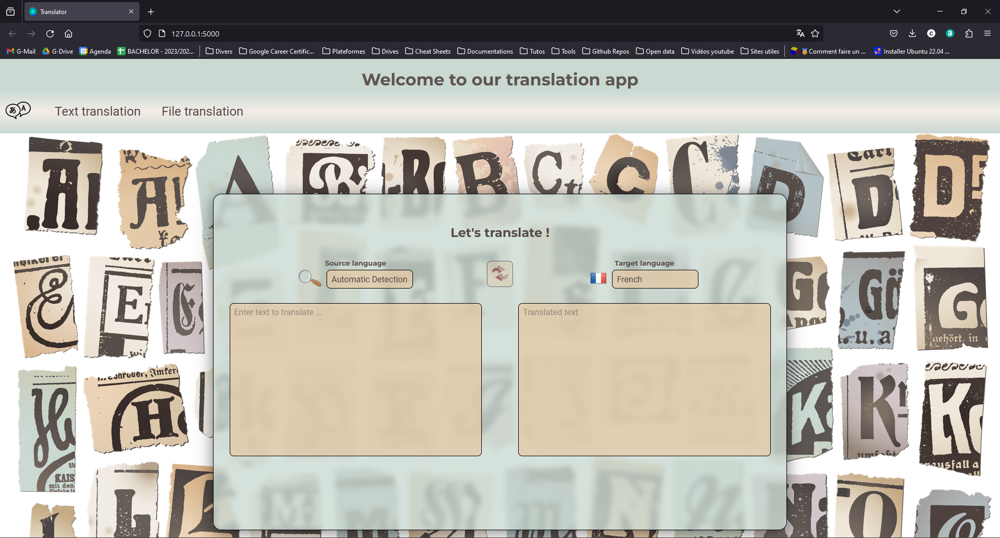
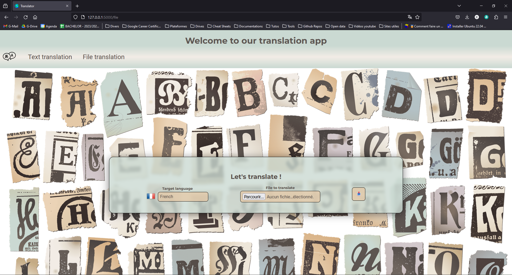

# lingua-franca

## Table of content
- [lingua-franca](#lingua-franca)
  - [Table of content](#table-of-content)
  - [Getting started](#getting-started)
    - [Install](#install)
    - [Use](#use)
  - [Context](#context)
    - [Introduction:](#introduction)
    - [1. Building the Application:](#1-building-the-application)
    - [2. Integrating Google Translation API:](#2-integrating-google-translation-api)
    - [3. Enhancing the User Interface:](#3-enhancing-the-user-interface)
  - [Product](#product)
    - [Description](#description)
    - [Screenshoots](#screenshoots)
  - [Project files](#project-files)
  - [The team](#the-team)

## Getting started
### Install
- Open git bash
- Clone the repository : `git clone https://github.com/christian-aucane/lingua-franca.git`
- Move in the repo : `cd lingua-franca`
- Launch install.sh : `source scripts/install.sh`
### Use
- Open git bash
- Launch run.sh : `source scripts/run.sh`
- Open navigator and go to this URL : http://127.0.0.1:5000/

## Context

### Introduction:
The titled "Lingua Franca" is designed as an educational project guide aimed at developing a text translation tool. It outlines a practical approach for learners to understand and implement text translation using modern technologies, specifically leveraging APIs and web frameworks.

### 1. Building the Application:
Flask Framework: Introduction to Flask, setting up the web application where users can input text for translation.

User Interface: Creating a user-friendly interface with fields for entering text, selecting source and target languages, and utilizing an automatic language detection feature.

### 2. Integrating Google Translation API:
API Connection: Detailed instructions on how to connect to the Google Translation API using a Python script.
Sending Requests and Receiving Translations: How to send user-inputted text to the API and display the translated text back to the user.

### 3. Enhancing the User Interface:
Aesthetic Improvements: Tips on using Cascading Style Sheets (CSS) and JavaScript to make the application visually appealing and more functional.

## Product
### Description
It's a web translation web application that uses Flask to create an API that connects to the public Google Translation API via the googletrans library.

### Screenshoots

*Index page screenshoot*

*File upload page screenshoot*

## Project files
- **images/** : README illustrations
- **samples/** : Samples files to test application
- **README.md** : Project details (this file)
- **.gitignore** : Files ignored by Git
- **requirements.txt** : Project dependencies
- **scripts/** : Bash scripts
    - **install.sh** : Install project
        - Create virtual environment
        - Install dependencies
    - **run.sh** : Run server
        - Activate virtual environment
        - Run src/app.py
- **src/** : Source files
    - **templates/** : Contain HTML templates
        - **base.html** : Base template
        - **index.html** : The index template
        - **file_upload.html** : The file upload page template
    - **forms.py** : Contain forms classes
        - `TranslationForm` : The form to translate text
        - `FileUploadForm` : The form to uplpoad files
    - **translation.py** : Contain functions to connect to the translation API
        - `list_languages()` : Return the list of allowed languages
        - `detect_language(text)` : Call the API and return the detexted language
        - `translate_text(text, from_language, to_language)` : Cal the API and return the translated text
    - **app.py** : Contain the Flask app, and routes
        - `index()` : Display the translate text interface
        - `file()` : Display the translate file interface
        - `file_upload()` : Translate the uploaded file and save in translated_files/ dir
        - `download_file()` : Download treanslated file in the client
        - `detect()` : Detect the language
        - `translate()` : Translate the text
    - **docx_processing.py** : To process docx files
        - `DocxTranslator` : To translate docx files
    - **process_files.py** : To process files
        - `process_txt_file(file, target_language)` : Process a txt file and return translated_file and detected_language
        - `process_docx_file(file, target_language)` : Process a docx file and return translated_file and detected_language
        - `process_file(file, target_language)` : Call the good processing function in relation to file extension
    - **static/** : Static files dirs
        - **js/** : JavaScript modules
            - **common/** : Common JS modules
                - **constants.js** : Constants namespaces
                    - `DomElements` : Namespace for usefull HTML Dom elements
                    - `ApiRoutes` : Namespace for API routes
                - **utils.js** : Utility functions namespaces
                    - `FormUtils` : Namespace for utility forms functions
                        - `updateFormFields(form, formData)` : Update the form with the FormData object
                        - `displayErrors(errors, defaultParentElement, errorMessageClass="error-message")` : Display the errors in the fields
                    - `ImgUtils` : Namespace for utility images functions
                        - `displayIcon(element, src)` : Change src and display img
                  - **ajaxFunctions.js** : AJAX functions namespace
                      - `AjaxFunctions` : Namespace for AJAX calls
                          - `detectLanguage(formData)` : Send a POST request to detect-language/ API route
                          - `translate(formData)` : Send a POST request to translate/ API route
                          - `uploadFile(formData)` : Send a POST request to upload and translate a file
                  - **flags.js** : Contain the flag displaying function
                      - `languageToCountryMap` : Object to map countries with languages
                      - `changeFlag(select)` : Change Flag icon

            - **index.js** : Index page JS script
                - `submitTranslationForm()` : Submit the form to the backend and modify display with the response
                - `reverseLanguages()` : Reverse source and target languages and submit form
                - `EnableDisableReverseLanguages()` : Enable/disable reverse languages button
                - `addFormChangeListeners()` : Add listeners on form fields to submit form when a field is modified
                - `init()` : Initialize event listeners and put navigator language in target language
            - **fileUpload.js** : File Upload page JS script
                - `submitFileUploadForm()` : Submit the form and modify display with the response
                - `init()` : Initialize event listeners and put navigator language in target language
        - **css/** : CSS files
            - **normalize.css** : To normalize styles
            - **variables.css** : Variables (Colors ...)
            - **style.css** : Project style
            - **index.css** : Index page style
            - **file_upload.css** : File Upload page style
            - **nav_bar.css** : Navbar style
        - **images/** : Images files
            - **status/** : Status images
                - **success.png** : Success image
                - **error.png** : Error image
                - **loading.png** : Loading image
            - **auto_language.png** : Flag icon for automatic detection language
            - **background.png** : Background image
            - **favicon.ico** : Icon
            - **reverse_languages.png** : Image for reverse languages button
            - **logo.png** : Logo in the navbar
  
## The team
3 students in the 1st year of the Bachelor IT program specializing in Artificial Intelligence at [La Plateforme_](https://laplateforme.io/) in Marseille, France

- Christian Aucane
  
  
- Bruno Coulet
  
  

- Léo Carrey
  
  